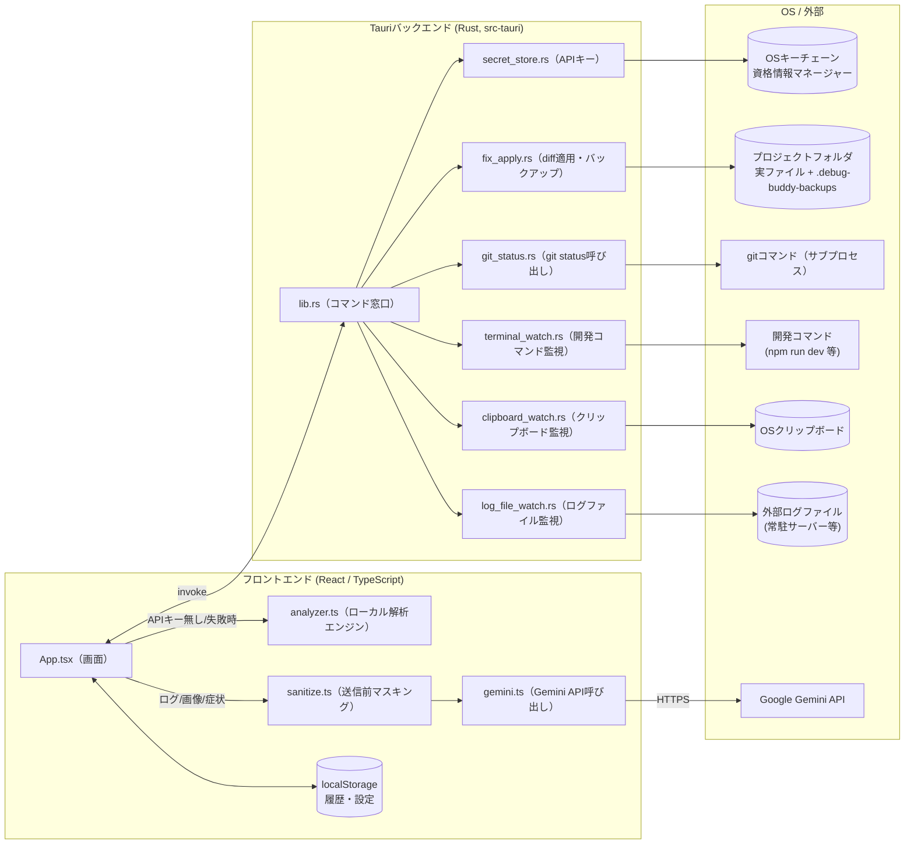
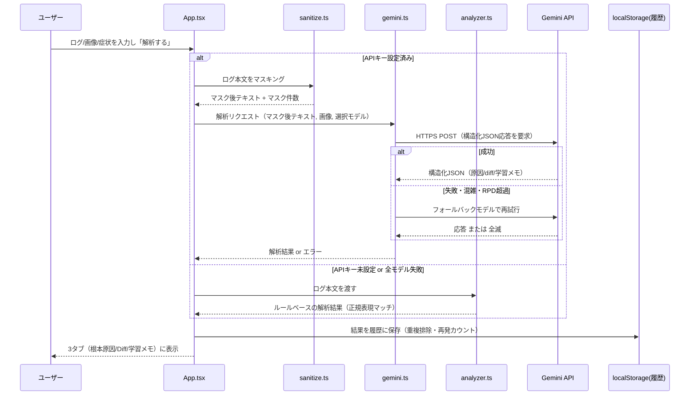
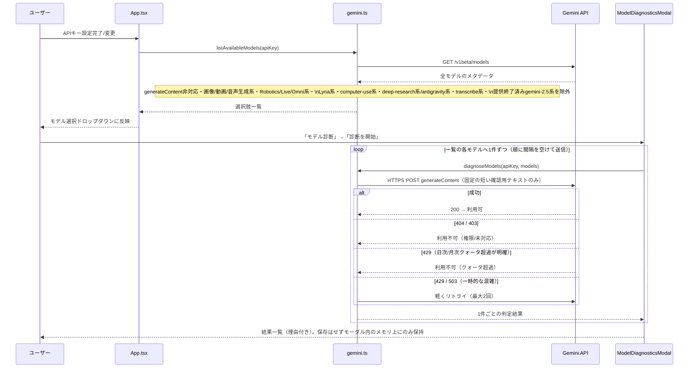
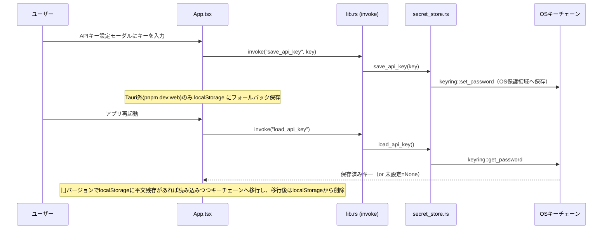
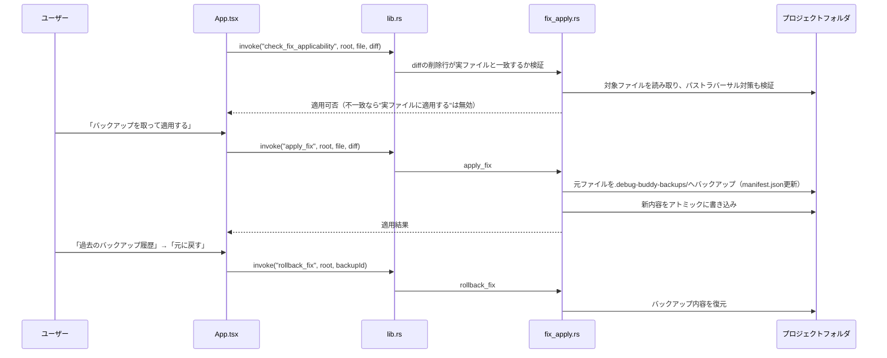
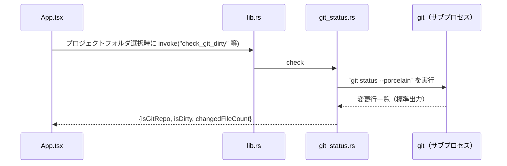
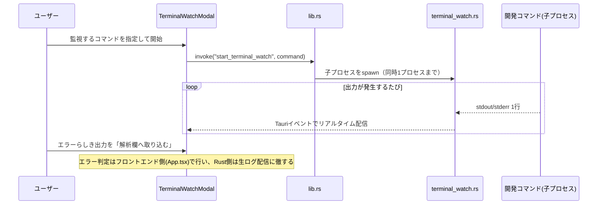
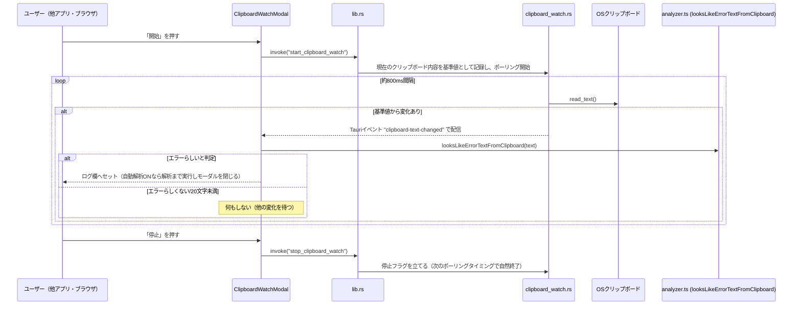
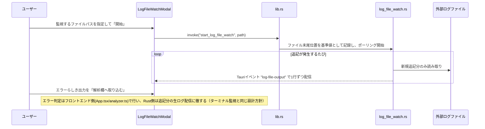

# データの流れ（アーキテクチャ・データフロー説明）

**対象読者**: アプリを評価するエンジニア
**目的**: 「どのデータが」「どこで生成され」「どこに保存され」「どこへ送信されるか」を、機能ごとに図解する。特にセキュリティ・プライバシーの観点（何が外部に送信され、何がローカルに留まるか）を評価する際の参考資料。
**関連**: [01_requirements_definition.md](01_requirements_definition.md) 5章（非機能要件）／[04_user_manual.md](04_user_manual.md)

---

## 1. 全体アーキテクチャ

- Gemini APIへ**送信されるのはログ・画像・症状の説明文（マスキング後）のみ**。プロジェクトのソースコード全体は送信しません（画面上でユーザーが貼り付けたテキスト/画像のみが対象）。
- 実ファイルの読み書き・Git確認・開発コマンド実行・APIキー保存は、すべてRust側（Tauriバックエンド）が担当し、フロントエンドから`invoke`経由で呼び出します。

---

## 2. ログ解析のデータフロー

**ポイント**:
- マスキング（[sanitize.ts](src/sanitize.ts)）は **Gemini APIへ送る直前にのみ** 実行されます。ローカル解析エンジンは外部送信しないため対象外です。
- マスク対象: PEM秘密鍵、AWSアクセスキー、GitHub Personal Access Token（`ghp_`等）、Google APIキー（`AIzaSy...`）、Slackトークン（`xoxb-`等）、Stripeキー（`sk_live_`等）、接頭辞のない裸のシークレットキー（`sk-...`）、各種`key=value`形式のAPIキー・パスワード、メールアドレス、**パブリックIPv4/IPv6アドレス**（プライベート/ループバックIPは開発情報として有用なため除外）など。
- 修正検証（「ログを再解析して検証する」）でGeminiへ送信する「直前に提示した修正案」の内容（要約・根本原因・diffCode/taskSteps）も、ログ本文と同じくこのマスキングを経てから送信されます。
- Gemini呼び出しが失敗した場合は自動的にローカル解析エンジンへフォールバックし、その旨をトースト通知で案内します。

---

## 3. モデル一覧取得・モデル診断のデータフロー

**ポイント**:
- モデル診断は、ドロップダウンに表示されている件数分だけGoogle Gemini APIを呼び出します（＝モデルの数だけクォータを消費）。ユーザーが「診断を開始」を押した時のみ実行され、自動実行はしません。
- 送信されるのは固定の短い確認用テキストのみで、入力欄のエラーログ・画像・症状説明は一切含まれません。
- 診断結果はモーダルを閉じると破棄されます（「結果をコピー」を押した場合のみ、クリップボードにコピーされます）。

---

## 4. Gemini APIキーのデータフロー

**ポイント**: デスクトップ版ではAPIキーは平文ファイルに保存されません（Windowsの資格情報マネージャー等、OSの保護領域を利用）。`pnpm dev:web` のようにTauriの外で動かした場合のみ`localStorage`に平文保存されます（ネイティブ機能が使えないブラウザ限定の代替経路）。

---

## 5. 実ファイル適用・バックアップ・ロールバックのデータフロー

**ポイント**:
- diffの「削除される行」がファイルの実内容と一字一句一致しない限り適用は拒否されます（AIの推測ミスによる誤書き込み防止）。
- バックアップは対象ファイルごとに最大20世代保持し、古いものから自動削除されます。
- バックアップ・manifestは対象プロジェクト内の `.debug-buddy-backups/` フォルダに保存されます（本リポジトリの管理外）。

---

## 6. Git連携のデータフロー

判定できない場合（gitがインストールされていない・対象がGit管理下にない等）はエラーにせず「判定不可」として扱い、実ファイル適用自体はブロックしません（あくまで注意喚起用のベストエフォート判定）。

---

## 7. ターミナル監視のデータフロー（試験的機能）

---

## 8. クリップボード監視のデータフロー（試験的機能）

**ポイント**:
- クリップボードの内容はメモリ上でポーリング・比較されるのみで、永続化・外部送信は一切行われません（エラーらしいと判定された内容だけが、通常の解析フローと同様にログ欄へ渡り、Gemini解析時のみマスキング後に送信されます）。
- 対象はテキストのみ。画像（スクリーンショット）はこのポーリングの対象外です。
- モーダルを開き直した際は `invoke("is_clipboard_watch_running")` で実際の監視状態を問い合わせ、画面表示を実態に合わせて補正します（開発中のリロードやアプリ再起動直後に、画面上は「未実行」なのにRust側では監視継続中、という食い違いを防ぐため）。
- ターミナル監視モードと状態管理（`OnceLock<Mutex<...>>`）は完全に独立しており、Rust側での競合はありません。フロントエンド側は共通の検知ハンドラを使うため、両方がほぼ同時にエラーを検知した場合は、先に解析処理が始まっている方を優先し、後着はログ欄へのセットのみに留めます。

---

## 9. ログファイル監視のデータフロー（試験的機能）

**ポイント**:
- 監視開始より前からファイルに書かれていた内容は対象外で、新たに追記された行のみが配信されます。
- モーダルを閉じても監視はバックグラウンドで継続します。モーダルを開き直した際は `invoke("is_log_file_watch_running")` で実際の監視状態を問い合わせ、画面表示を補正します（クリップボード監視と同じ設計）。
- ファイル内容はメモリ上でストリーミングされるのみで、永続化・外部送信は一切行われません（エラーらしいと判定された内容だけが、通常の解析フローと同じ経路でログ欄へ渡ります）。

---

## 10. 解析履歴のデータフロー

- 保存先: ブラウザ/Webviewの `localStorage`（キー: `debug_buddy_history`）。**外部へは送信されません。**
- 最大100件。同一エラー（ファイル・行・エラー種別等が一致）は重複排除し、既存エントリの「再発回数」をインクリメント。
- エクスポート操作時のみ、JSON/Markdownとしてローカルファイルに書き出されます（`export_text_file` コマンド経由でRust側がファイル保存ダイアログを表示）。
- **振り返りダッシュボード**（[src/historyStats.ts](src/historyStats.ts)）は、この`localStorage`上の履歴を読み取って集計するのみで、新たな永続化・外部送信は発生しません。

---

## 11. データ保存先まとめ

| データ | 保存場所 | 平文か | 外部送信の有無 |
|---|---|---|---|
| Gemini APIキー（デスクトップ版） | OSキーチェーン | 暗号化/OS保護 | 送信先はGoogle Gemini APIのみ（リクエストヘッダー） |
| Gemini APIキー（Web版のみ） | `localStorage`（平文） | 平文 | 同上 |
| エラーログ本文・画像・症状説明 | 送信時のみメモリ上 | — | **Gemini API利用時のみ**、マスキング後にGoogleへ送信。ローカル解析時は送信なし |
| 解析結果・履歴 | `localStorage` | 平文 | 送信なし |
| モデル選択・テーマ・プロジェクトフォルダパス等の設定 | `localStorage` | 平文 | 送信なし |
| 修正前ファイルのバックアップ | 対象プロジェクト内 `.debug-buddy-backups/` | 平文（ソースコードそのまま） | 送信なし |
| 開発コマンドの標準出力/標準エラー | メモリ上でストリーミングのみ（永続化なし） | — | 送信なし |
| クリップボードの内容（監視ON時のみ） | メモリ上でポーリング・比較のみ（永続化なし） | — | エラーらしいと判定された内容のみ、通常の解析フローと同じ経路でログ欄へ渡る（Gemini利用時はマスキング後に送信） |
| 外部ログファイルの追記内容（監視ON時のみ） | メモリ上でストリーミングのみ（永続化なし） | — | エラーらしいと判定された内容のみ、通常の解析フローと同じ経路でログ欄へ渡る（Gemini利用時はマスキング後に送信） |
| フォローアップ質問の内容 | 送信時のみメモリ上（画面を離れると破棄、履歴には保存されない） | — | Gemini APIキー設定時のみ、直前の解析結果（要約・根本原因・diffCode/taskSteps）と合わせてGoogleへ送信 |
| モデル診断の確認用テキスト（固定文言、ログ本文は含まない） | 送信時のみメモリ上 | — | 診断実行時のみ、モデルの数だけGoogle Gemini APIへ送信。結果はモーダルを閉じると破棄され、保存・外部送信はされない |
