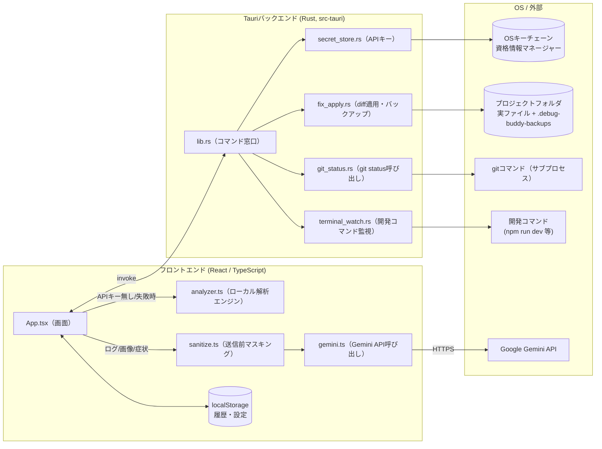
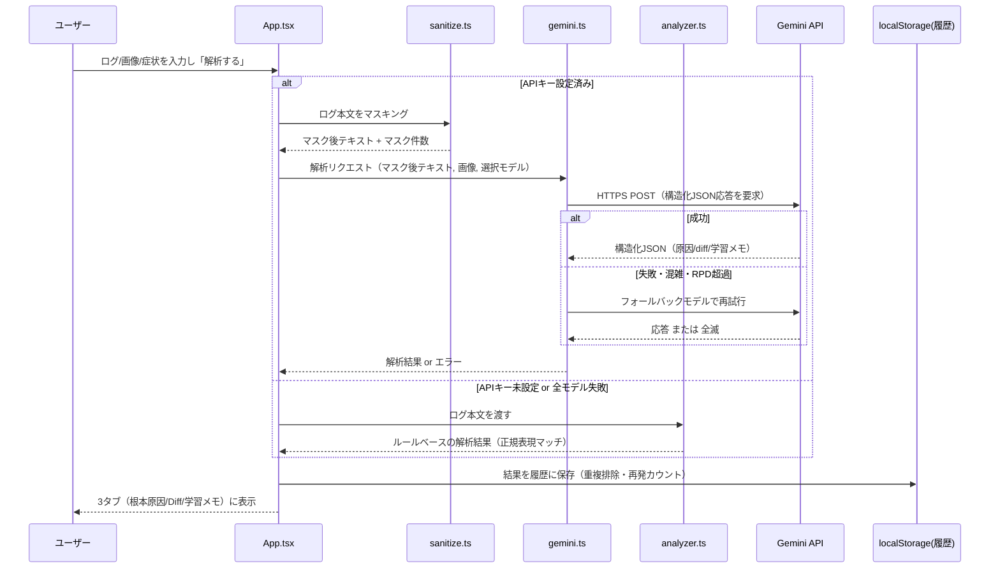
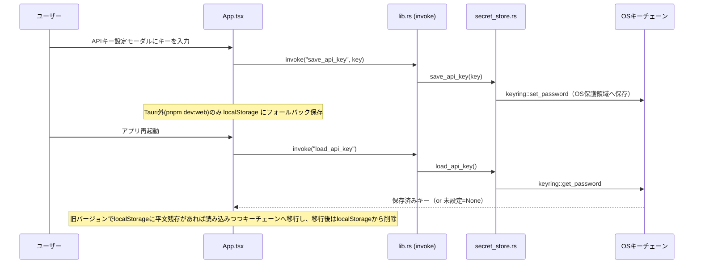
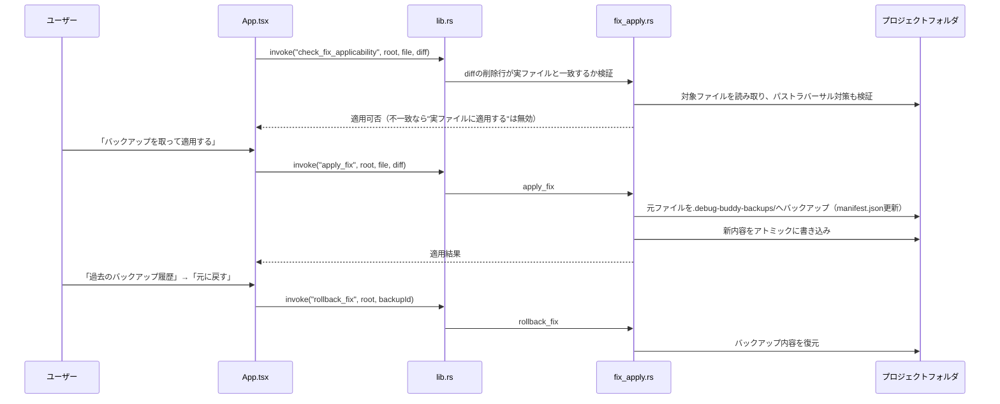
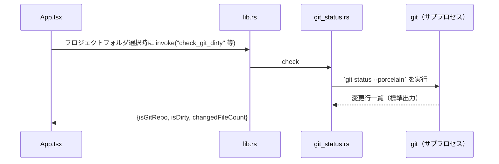
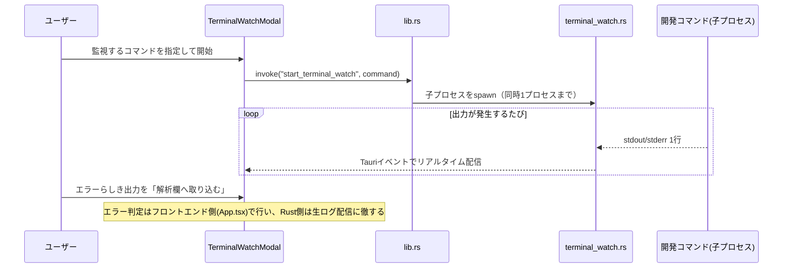

# データの流れ（アーキテクチャ・データフロー説明）

**対象読者**: アプリを評価するエンジニア
**目的**: 「どのデータが」「どこで生成され」「どこに保存され」「どこへ送信されるか」を、機能ごとに図解する。特にセキュリティ・プライバシーの観点（何が外部に送信され、何がローカルに留まるか）を評価する際の参考資料。
**関連**: [01_requirements_definition.md](01_requirements_definition.md) 5章（非機能要件）／[04_user_manual.md](04_user_manual.md)

---

## 1. 全体アーキテクチャ

- Gemini APIへ**送信されるのはログ・画像・症状の説明文（マスキング後）のみ**。プロジェクトのソースコード全体は送信しません（画面上でユーザーが貼り付けたテキスト/画像のみが対象）。
- 実ファイルの読み書き・Git確認・開発コマンド実行・APIキー保存は、すべてRust側（Tauriバックエンド）が担当し、フロントエンドから`invoke`経由で呼び出します。

---

## 2. ログ解析のデータフロー

**ポイント**:
- マスキング（[sanitize.ts](src/sanitize.ts)）は **Gemini APIへ送る直前にのみ** 実行されます。ローカル解析エンジンは外部送信しないため対象外です。
- マスク対象: PEM秘密鍵、AWSアクセスキー、各種APIキーらしき文字列、パスワード、メールアドレス、**パブリックIP**（プライベート/ループバックIPは開発情報として有用なため除外）など。
- Gemini呼び出しが失敗した場合は自動的にローカル解析エンジンへフォールバックし、その旨をトースト通知で案内します。

---

## 3. Gemini APIキーのデータフロー

**ポイント**: デスクトップ版ではAPIキーは平文ファイルに保存されません（Windowsの資格情報マネージャー等、OSの保護領域を利用）。`pnpm dev:web` のようにTauriの外で動かした場合のみ`localStorage`に平文保存されます（ネイティブ機能が使えないブラウザ限定の代替経路）。

---

## 4. 実ファイル適用・バックアップ・ロールバックのデータフロー

**ポイント**:
- diffの「削除される行」がファイルの実内容と一字一句一致しない限り適用は拒否されます（AIの推測ミスによる誤書き込み防止）。
- バックアップは対象ファイルごとに最大20世代保持し、古いものから自動削除されます。
- バックアップ・manifestは対象プロジェクト内の `.debug-buddy-backups/` フォルダに保存されます（本リポジトリの管理外）。

---

## 5. Git連携のデータフロー

判定できない場合（gitがインストールされていない・対象がGit管理下にない等）はエラーにせず「判定不可」として扱い、実ファイル適用自体はブロックしません（あくまで注意喚起用のベストエフォート判定）。

---

## 6. ターミナル監視のデータフロー（試験的機能）

---

## 7. 解析履歴のデータフロー

- 保存先: ブラウザ/Webviewの `localStorage`（キー: `debug_buddy_history`）。**外部へは送信されません。**
- 最大100件。同一エラー（ファイル・行・エラー種別等が一致）は重複排除し、既存エントリの「再発回数」をインクリメント。
- エクスポート操作時のみ、JSON/Markdownとしてローカルファイルに書き出されます（`export_text_file` コマンド経由でRust側がファイル保存ダイアログを表示）。

---

## 8. データ保存先まとめ

| データ | 保存場所 | 平文か | 外部送信の有無 |
|---|---|---|---|
| Gemini APIキー（デスクトップ版） | OSキーチェーン | 暗号化/OS保護 | 送信先はGoogle Gemini APIのみ（リクエストヘッダー） |
| Gemini APIキー（Web版のみ） | `localStorage`（平文） | 平文 | 同上 |
| エラーログ本文・画像・症状説明 | 送信時のみメモリ上 | — | **Gemini API利用時のみ**、マスキング後にGoogleへ送信。ローカル解析時は送信なし |
| 解析結果・履歴 | `localStorage` | 平文 | 送信なし |
| モデル選択・テーマ・プロジェクトフォルダパス等の設定 | `localStorage` | 平文 | 送信なし |
| 修正前ファイルのバックアップ | 対象プロジェクト内 `.debug-buddy-backups/` | 平文（ソースコードそのまま） | 送信なし |
| 開発コマンドの標準出力/標準エラー | メモリ上でストリーミングのみ（永続化なし） | — | 送信なし |
